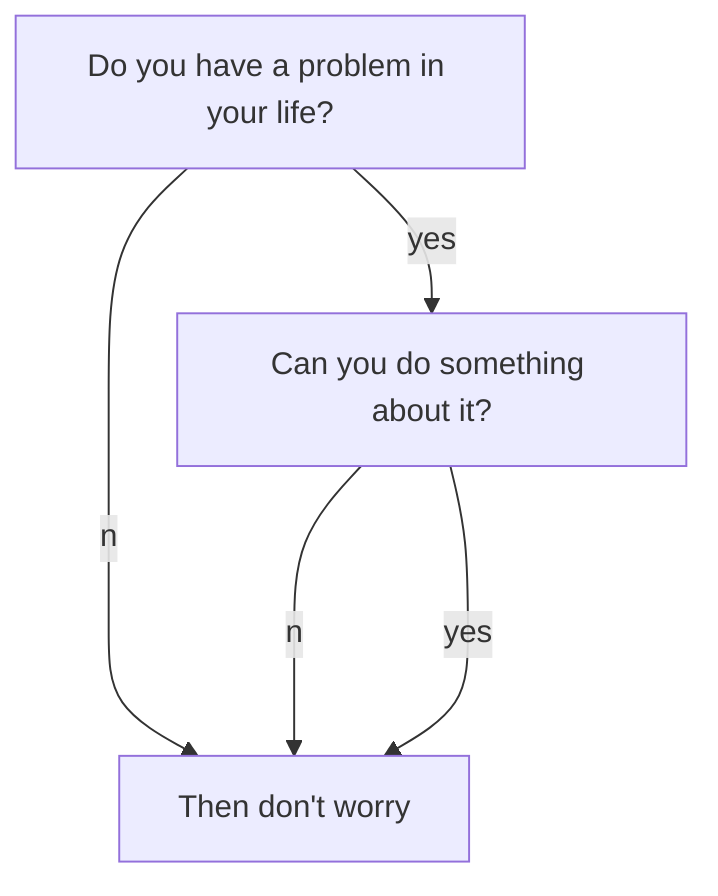

此处为示例文件的摘要~

<!--more-->

正文在下面

分级标题采用`#`的个数确定，其中导航目录只提供1-3级标题的导航

# 一级

## 二级

### 三级

#### 四级


# 数学

数学公式已经默认启动，没有启动自动编号，但是可以在头文件声明`mathjax_autoNumber: true`来开启。

测试功能：

- 内联`$$`：$\alpha$
- 内联`\\( \\)`:\\( \beta\\) 
- 行间`$$$$`：

$$
\int_0^\infty x^{a-1}e^{-x}=\Gamma(a)
$$

- 行间`\\[\\]`：

\\[
\int_0^\infty x^{a-1}e^{-x}=\Gamma(a)
\\]

# mermaid流程图

支持mermaid扩展，这个在Typora也可以预览，注意语法规范，比如（`;`）的使用。
```
graph TB;
    A[Do you have a problem in your life?]
    B[Then don't worry]
    C[Can you do something about it?]
    A--no-->B;
    A--yes-->C;
    C--no-->B;
    C--yes-->B;
```




# 特殊扩展

标签比如`info`{:.info}请参考：https://tianqi.name/jekyll-TeXt-theme/docs/zh/additional-styles

嵌入多媒体请参考：https://tianqi.name/jekyll-TeXt-theme/docs/zh/extensions

如果要引用另一篇博客请使用特殊url（`{}`之内的写法，替换文件名）：

```
[示例文件]()
```

